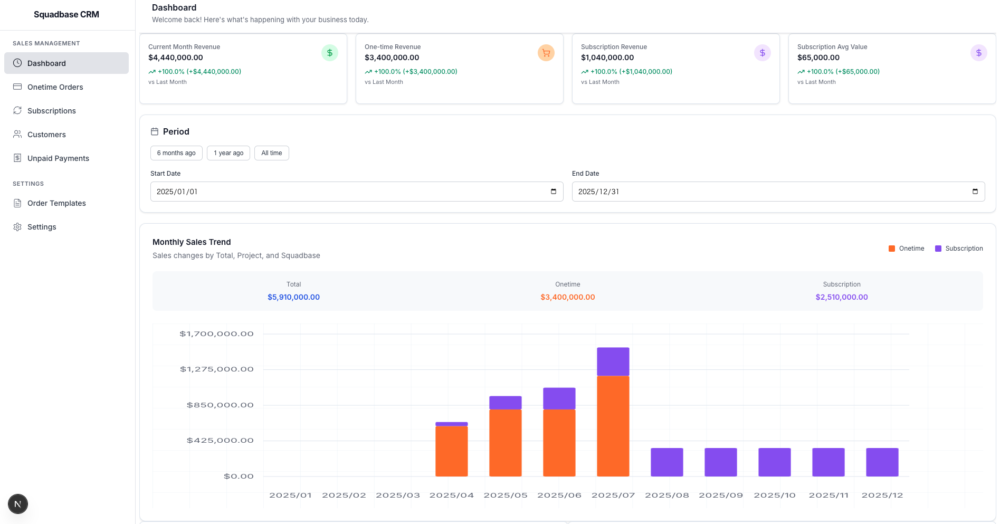
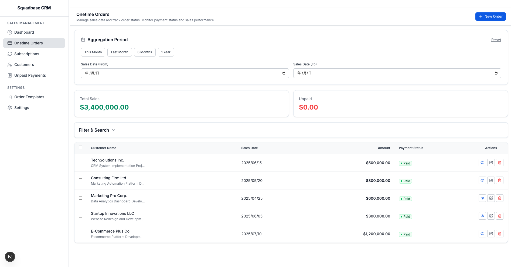
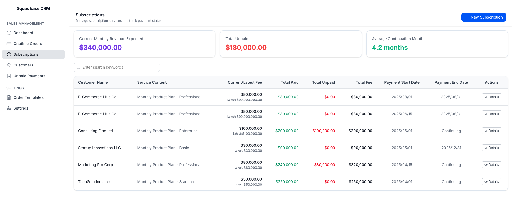
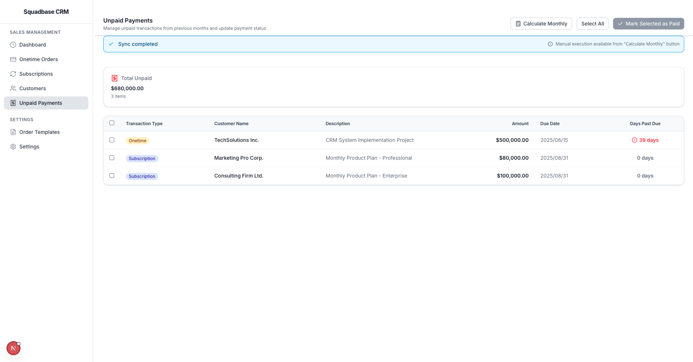

<h1 align="center">Squadbase CRM</h1>

An open-source Customer Relationship Management (CRM) system designed for easy customization with Claude Code.

## Ready to customize your CRM with Claude Code?

CRM is vital but usually overpriced and hard to bend to your process.

Our open‑source, self‑hosted CRM pairs with Claude Code, letting anyone refactor fields, workflows, and automations in plain language—no vendor lock‑in or proprietary scripts.

Result: zero license fees, total data control, and a CRM that fits your business in hours, not months.

## Installation

🖥️ [Local Setup](./docs/localSetup.md)

🗣️💰 [Internationalization](./docs/i18n.md)

### One-click Deployment

Deploy your own Squadbase CRM instance with a single click. Squadbase automatically provides authentication and access control for secure CRM operations. You can start using it for free if you have less than 5 members.

#### PostgreSQL Setup

Squadbase CRM requires only PostgreSQL.
[Neon](https://neon.com/) is our recommended PostgreSQL hosting service where you can easily deploy your own PostgreSQL instance.

Database migrations are handled automatically via `npm run build`.
This command will be triggered in squadbase when you push to the repository.

For Squadbase's build and deployment environments, allow IP communication to automatically configure the database on Postgres and launch the CRM.

Please configure the following IP addresses in your PostgreSQL whitelist:

- **Build Server:** `54.150.149.0`
- **App Server:**
After deployment, check the Allow IPs screen and configure the IP addresses.
[Details here](https://www.squadbase.dev/en/docs/features/fixed-ip-addresses).

## Features

- [Revenue analytics](#revenue-analytics)
- [Onetime order tracking](#onetime-order-tracking)
- [Subscription management](#subscription-management)
- [Unpaid management](#unpaid-management)

We have a [Roadmap](./docs/roadmap.md) for the future features. Feedback and feature requests are welcome!

### Revenue Analytics

### Onetime order tracking

### Subscription management

### Unpaid management

## Stack

- **Next.js v15** - React framework
- **TypeScript** - Type safety
- **TailwindCSS v4** - Styling
- **shadcn/ui** - Component library
- **Drizzle ORM** - Database toolkit
- **PostgreSQL** - Database

## Recommended Tools to Use Together

- Deploy on [Squadbase](https://squadbase.dev/) for Authentication and Access Control.
- Host PostgreSQL on [Neon](https://neon.com/) for easy deployment.
- Build with [Claude Code](https://www.anthropic.com/claude-code) for AI-powered customization.

## License

This project is licensed under the Apache License 2.0 - see the LICENSE file for details.